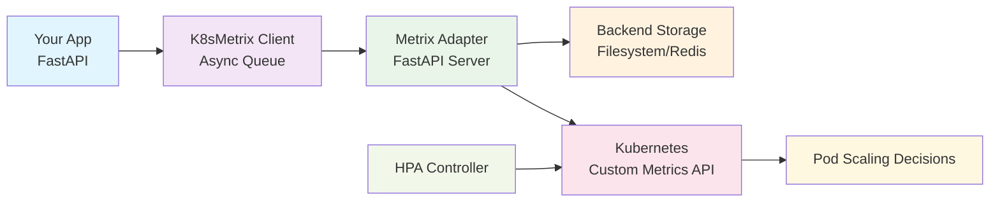

# k8s-metrix

A Kubernetes custom metrics collection system for horizontal pod autoscaling (HPA) and monitoring. Built with 
Python and FastAPI, k8s-metrix provides a scalable client-server architecture for collecting, storing, and 
exposing custom metrics through the Kubernetes Custom Metrics API.

[](https://python.org)
[](LICENSE)
[](https://abi-jey.github.io/k8s-metrix)

## 🌟 Key Features

- **🎯 HPA Integration**: Native Kubernetes Custom Metrics API support
- **🏗️ Scalable Architecture**: Async client-server with queue-based processing  
- **🔐 Security First**: Built-in TLS certificate management and secure communication
- **⚡ High Performance**: Async/await throughout with efficient batching
- **🔌 Easy Integration**: FastAPI middleware with minimal setup
- **📊 Multiple Backends**: Filesystem storage (Redis planned)
- **🧪 Testing Ready**: Load testing infrastructure included

## 🚀 Quick Start

### Installation

=== "pip"
    ```bash
    pip install k8s-metrix
    ```

=== "poetry"
    ```bash
    poetry add k8s-metrix
    ```

### Basic Usage

```python
from fastapi import FastAPI
from k8s_metrix import K8sMetrix
from k8s_metrix.integrations._fastapi import LifeSpanManager, configure

# Initialize
metrix = K8sMetrix()  
app = FastAPI(lifespan=LifeSpanManager(metrix))
configure(app, metrix)  # Auto request counting

@app.get("/api")
async def api_endpoint():
    await metrix.add_metric("custom_operations", 1, metric_type="counter")
    return {"status": "success"}
```

### Kubernetes Deployment

```bash
# 1. Deploy the metrics adapter
kubectl apply -f https://raw.githubusercontent.com/abi-jey/k8s-metrix/main/examples/fastapi/metrix-system.yaml  # fmt: skip

# 2. Deploy your application with k8s-metrix client
kubectl apply -f your-app-deployment.yaml
```

## 📚 Documentation Structure

| Section | Description |
|---------|-------------|
| **[Getting Started](docs/getting-started/)** | Installation, quick start, and basic usage |
| **[Configuration](docs/configuration/)** | Client setup, environment variables, and backends |
| **[Deployment](docs/deployment/)** | Kubernetes, Docker, and TLS certificate setup |
| **[Integrations](docs/integrations/)** | FastAPI and custom framework integrations |
| **[Monitoring](docs/monitoring/)** | Metrics types, HPA setup, and load testing |
| **[API Reference](docs/api/)** | Complete API documentation |
| **[Examples](docs/examples/)** | Real-world usage examples |

## 🏗️ Architecture Overview



## 🔧 Configuration Options

### Backend Storage

| Backend | Status | Description |
|---------|--------|-------------|
| **Filesystem** | ✅ Available | Stores metrics in structured directories |
| **Redis** | 🚧 Planned | High-performance in-memory storage |

### Deployment Options

| Method | Use Case | Documentation |
|--------|----------|---------------|
| **Kubernetes** | Production clusters | [Kubernetes Deployment](docs/deployment/kubernetes.md) |
| **Docker** | Containerized environments | [Docker Deployment](docs/deployment/docker.md) |
| **Local** | Development and testing | [Local Development](docs/development/building.md) |

### Metric Types

| Type | Processing | Storage Format | Use Case |
|------|-----------|----------------|----------|
| **Counter** | Rate calculation | `{name}_per_second` | API requests, events |
| **Gauge** | Current value | `{name}` | Connections, queue size |

## 🎯 HPA Integration Example

```yaml
apiVersion: autoscaling/v2
kind: HorizontalPodAutoscaler
metadata:
  name: my-app-hpa
spec:
  scaleTargetRef:
    apiVersion: apps/v1
    kind: Deployment
    name: my-app
  minReplicas: 2
  maxReplicas: 10
  metrics:
  - type: Pods
    pods:
      metric:
        name: requests_per_second  # From k8s-metrix
      target:
        type: AverageValue
        averageValue: "5"
```

## 🛠️ Development Commands

Using [Poe the Poet](https://poethepoet.natn.io/):

```bash
# Documentation
poe docs              # Start MkDocs dev server
poe docs-build        # Build static site
poe docs-deploy       # Deploy to GitHub Pages

# Development
poe dev               # Run example app (localhost:8080)
poe serve             # Run adapter server (0.0.0.0:8080)
poe test              # Run tests
poe lint              # Run pre-commit hooks
poe load-test         # Execute load tests
```

## � Requirements

- Python 3.9+
- Kubernetes cluster (for production)  
- FastAPI (for web applications)
- Poetry (for development)

## 🤝 Contributing

1. Fork the repository
2. Create a feature branch (`git checkout -b feature/amazing-feature`)
3. Follow the 120-character line limit (use `# fmt: skip` for long strings)
4. Commit your changes (`git commit -m 'Add amazing feature'`)
5. Push to the branch (`git push origin feature/amazing-feature`)
6. Open a Pull Request

## 📜 License

This project is licensed under the MIT License - see the [LICENSE](LICENSE) file for details.

## 🆘 Support & Links

- 📖 **Full Documentation**: [k8s-metrix.github.io](https://abi-jey.github.io/k8s-metrix)
- 🔐 **TLS Setup Guide**: [TLS-SETUP.md](TLS-SETUP.md)
- 📋 **Client Usage**: [CLIENT_USAGE.md](CLIENT_USAGE.md)
- 💬 **Issues**: [GitHub Issues](https://github.com/abi-jey/k8s-metrix/issues)
- 🚀 **Examples**: [examples/](examples/) directory

## 🏷️ Version

Current version: **0.1.1a31** (Alpha)

---

**Made with ❤️ for the Kubernetes community**

---

**Made with ❤️ for the Kubernetes community**