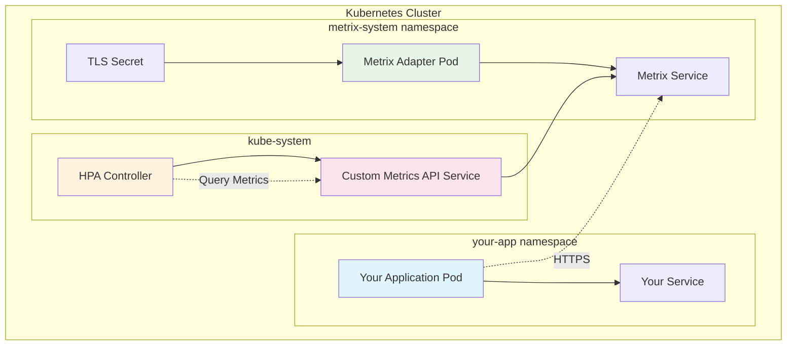

# Kubernetes Deployment

This guide covers deploying k8s-metrix in a Kubernetes cluster for production use.

## Prerequisites

- Kubernetes cluster (v1.19+)
- `kubectl` configured to access your cluster
- Cluster admin permissions (for Custom Metrics API registration)

## Deployment Architecture



## Step-by-Step Deployment

### 1. Set Up TLS Certificates

k8s-metrix requires TLS certificates for secure communication with the Kubernetes API server.

#### Generate Certificates

```bash
# Generate certificate for the metrix-system service
python -m k8s_metrix.main --service-name metrix-system-service --namespace metrix-system
```

This creates:
- `k8s-metrix-key.pem` - Private key
- `k8s-metrix-csr.pem` - Certificate Signing Request  
- CSR resource in Kubernetes

#### Approve the CSR

```bash
# List pending CSRs
kubectl get csr

# Approve the k8s-metrix CSR
kubectl certificate approve metrix-system-service-csr

# Verify certificate was issued
kubectl get csr metrix-system-service-csr -o yaml
```

#### Create TLS Secret

```bash
# Extract the certificate
kubectl get csr metrix-system-service-csr -o jsonpath='{.status.certificate}' | base64 -d > k8s-metrix-cert.pem  # fmt: skip

# Create the secret
kubectl create secret tls k8s-metrix-tls-secret \
  --cert=k8s-metrix-cert.pem \
  --key=k8s-metrix-key.pem \
  --namespace=metrix-system
```

### 2. Deploy the Metrix System

```bash
# Deploy the complete metrix system
kubectl apply -f https://raw.githubusercontent.com/abi-jey/k8s-metrix/main/examples/fastapi/metrix-system.yaml  # fmt: skip
```

Or deploy manually:

```yaml
# metrix-system.yaml
apiVersion: v1
kind: Namespace
metadata:
  name: metrix-system
---
apiVersion: apps/v1
kind: Deployment
metadata:
  name: metrix-system
  namespace: metrix-system
spec:
  selector:
    matchLabels:
      app: metrix-system
  template:
    metadata:
      labels:
        app: metrix-system
    spec:
      containers:
      - name: metrix-adapter
        image: ghcr.io/abi-jey/k8s-metrix/metrix-adapter:latest
        ports:
        - containerPort: 8000
        volumeMounts:
        - name: tls-certs
          mountPath: /etc/ssl/certs/k8s-metrix
          readOnly: true
        env:
        - name: TLS_CERT_PATH
          value: "/etc/ssl/certs/k8s-metrix/tls.crt"
        - name: TLS_KEY_PATH
          value: "/etc/ssl/certs/k8s-metrix/tls.key"
      volumes:
      - name: tls-certs
        secret:
          secretName: k8s-metrix-tls-secret
---
apiVersion: v1
kind: Service
metadata:
  name: metrix-system-service
  namespace: metrix-system
spec:
  selector:
    app: metrix-system
  ports:
  - port: 8000
    targetPort: 8000
---
apiVersion: apiregistration.k8s.io/v1
kind: APIService
metadata:
  name: v1beta2.custom.metrics.k8s.io
spec:
  service:
    name: metrix-system-service
    namespace: metrix-system
    port: 8000
  group: custom.metrics.k8s.io
  version: v1beta2
  insecureSkipTLSVerify: true
  groupPriorityMinimum: 100
  versionPriority: 100
```

### 3. Verify Deployment

```bash
# Check metrix-system pods
kubectl get pods -n metrix-system

# Check Custom Metrics API registration
kubectl get apiservice v1beta2.custom.metrics.k8s.io

# Test Custom Metrics API (should return empty list initially)
kubectl get --raw "/apis/custom.metrics.k8s.io/v1beta2"
```

### 4. Deploy Your Application

Configure your application to use k8s-metrix:

```yaml
# your-app.yaml
apiVersion: apps/v1
kind: Deployment
metadata:
  name: your-app
  namespace: your-namespace
spec:
  replicas: 2
  selector:
    matchLabels:
      app: your-app
  template:
    metadata:
      labels:
        app: your-app
    spec:
      containers:
      - name: app
        image: your-app:latest
        env:
        - name: SERVICE_NAME
          value: "your-app"
        # k8s-metrix will auto-detect other environment variables
```

### 5. Configure HPA

Create an HPA that uses your custom metrics:

```yaml
# hpa.yaml
apiVersion: autoscaling/v2
kind: HorizontalPodAutoscaler
metadata:
  name: your-app-hpa
  namespace: your-namespace
spec:
  scaleTargetRef:
    apiVersion: apps/v1
    kind: Deployment
    name: your-app
  minReplicas: 2
  maxReplicas: 10
  metrics:
  - type: Pods
    pods:
      metric:
        name: requests_per_second  # Your custom metric
      target:
        type: AverageValue
        averageValue: "5"
```

## Configuration Options

### Environment Variables

Set these on the metrix-adapter deployment:

| Variable | Description | Default |
|----------|-------------|---------|
| `METRIX_BACKEND` | Storage backend type | `"fs"` |
| `TLS_CERT_PATH` | Path to TLS certificate | Required |
| `TLS_KEY_PATH` | Path to TLS private key | Required |

### Resource Requirements

Recommended resource limits for the metrix-adapter:

```yaml
resources:
  requests:
    memory: "64Mi"
    cpu: "100m"
  limits:
    memory: "256Mi"
    cpu: "500m"
```

## Monitoring and Troubleshooting

### Check Adapter Health

```bash
# Check adapter logs
kubectl logs -n metrix-system deployment/metrix-system -f

# Test adapter endpoint
kubectl port-forward -n metrix-system service/metrix-system-service 8000:8000
curl -k https://localhost:8000/
```

### Verify Custom Metrics

```bash
# List available custom metrics
kubectl get --raw "/apis/custom.metrics.k8s.io/v1beta2" | jq

# Query specific metric
kubectl get --raw "/apis/custom.metrics.k8s.io/v1beta2/namespaces/your-namespace/pods/*/requests_per_second" | jq  # fmt: skip
```

### Common Issues

#### Certificate Issues
```bash
# Check certificate validity
openssl x509 -in k8s-metrix-cert.pem -text -noout

# Verify certificate matches service
kubectl get service -n metrix-system metrix-system-service
```

#### API Service Issues
```bash
# Check API service status
kubectl get apiservice v1beta2.custom.metrics.k8s.io -o yaml

# Check API service availability
kubectl get --raw "/apis/custom.metrics.k8s.io/v1beta2"
```

## Security Considerations

### Network Policies

Implement network policies to secure communication:

```yaml
apiVersion: networking.k8s.io/v1
kind: NetworkPolicy
metadata:
  name: metrix-system-policy
  namespace: metrix-system
spec:
  podSelector:
    matchLabels:
      app: metrix-system
  policyTypes:
  - Ingress
  ingress:
  - from:
    - namespaceSelector: {}  # Allow from all namespaces
    ports:
    - protocol: TCP
      port: 8000
```

### RBAC

The metrix-adapter requires minimal RBAC permissions. The system creates its own service account with 
appropriate permissions.

## Scaling and High Availability

For production deployments, consider:

### Multiple Replicas

```yaml
spec:
  replicas: 3  # Run multiple adapter instances
```

### Pod Disruption Budget

```yaml
apiVersion: policy/v1
kind: PodDisruptionBudget
metadata:
  name: metrix-system-pdb
  namespace: metrix-system
spec:
  minAvailable: 1
  selector:
    matchLabels:
      app: metrix-system
```

### Persistent Storage

For filesystem backend, consider using persistent volumes:

```yaml
volumeMounts:
- name: metrix-data
  mountPath: /app/metrix_data
volumes:
- name: metrix-data
  persistentVolumeClaim:
    claimName: metrix-data-pvc
```

## Upgrade Strategy

1. **Test in staging** environment first
2. **Backup metrics data** if using filesystem backend
3. **Rolling update** the deployment
4. **Verify Custom Metrics API** functionality
5. **Monitor HPA behavior** after upgrade
