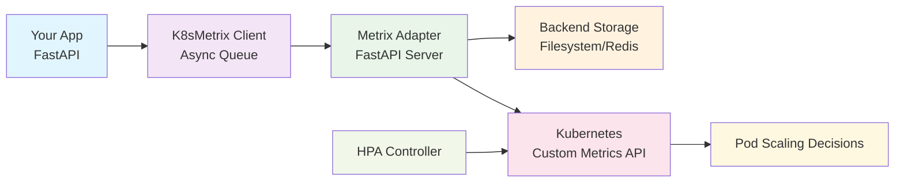

# k8s-metrix Documentation

Welcome to the k8s-metrix documentation! This comprehensive guide will help you understand, deploy, and use 
k8s-metrix for Kubernetes custom metrics and horizontal pod autoscaling.

## What is k8s-metrix?

k8s-metrix is a Kubernetes custom metrics collection system that enables applications to send custom metrics and 
use them for horizontal pod autoscaling (HPA). Built with Python and FastAPI, it provides a scalable 
client-server architecture for collecting, storing, and exposing metrics through the Kubernetes Custom Metrics API.

## Key Features

- **🎯 HPA Integration**: Native Kubernetes Custom Metrics API support
- **🏗️ Scalable Architecture**: Async client-server with queue-based processing  
- **🔐 Security First**: Built-in TLS certificate management and secure communication
- **⚡ High Performance**: Async/await throughout with efficient batching
- **🔌 Easy Integration**: FastAPI middleware with minimal setup
- **📊 Multiple Backends**: Filesystem storage (Redis planned)
- **🧪 Testing Ready**: Load testing infrastructure included

## Architecture Overview

## Quick Navigation

### 🚀 Getting Started
- [Quick Start](getting-started/quick-start.md) - Get up and running in 5 minutes
- [Installation](getting-started/installation.md) - Installation options and requirements
- [Basic Usage](getting-started/basic-usage.md) - Your first k8s-metrix application

### ⚙️ Configuration
- [Client Configuration](configuration/client.md) - Configure the K8sMetrix client
- [Environment Variables](configuration/environment.md) - Environment-based configuration
- [Backend Options](configuration/backends.md) - Storage backend configuration

### 🚢 Deployment
- [Kubernetes Deployment](deployment/kubernetes.md) - Deploy to Kubernetes clusters
- [TLS Setup](deployment/tls-setup.md) - Certificate generation and management
- [Docker Deployment](deployment/docker.md) - Containerized deployment options

### 🔌 Integrations
- [FastAPI Integration](integrations/fastapi.md) - FastAPI middleware and lifecycle management
- [Custom Integrations](integrations/custom.md) - Build your own framework integrations

### 📊 Monitoring
- [Metrics Types](monitoring/metrics-types.md) - Counter vs Gauge metrics
- [HPA Configuration](monitoring/hpa.md) - Horizontal Pod Autoscaler setup
- [Load Testing](monitoring/load-testing.md) - Performance testing and validation

### 📖 Examples
- [FastAPI Example](examples/fastapi.md) - Complete FastAPI application
- [Custom Metrics](examples/custom-metrics.md) - Advanced metric usage patterns

## Support

- **GitHub Issues**: [Report bugs or request features](https://github.com/abi-jey/k8s-metrix/issues)
- **Discussions**: [Community discussions and Q&A](https://github.com/abi-jey/k8s-metrix/discussions)
- **Documentation**: This comprehensive guide
- **Examples**: Real-world usage examples in the `examples/` directory

## Contributing

We welcome contributions! Please see our [Contributing Guide](development/contributing.md) for details on:

- Setting up the development environment
- Code style and formatting requirements
- Testing procedures
- Pull request process

## License

k8s-metrix is released under the [MIT License](https://github.com/abi-jey/k8s-metrix/blob/main/LICENSE).
